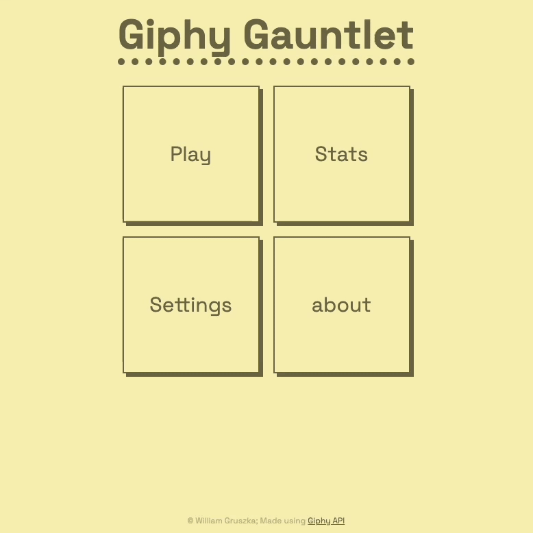

# Giphy Gauntlet

Giphy Gauntlet is a simple in browser game where you have to guess as many words as possible based on the GIFs shown within a given timeframe. Build using Vanilla JS, HTML, CSS and the [Giphy API](https://developers.giphy.com) for the gifs.

  
  
  

## Setup

1. add a Beta or Production Giphy API key to the `GIPHY_API_KEY` const in `script.js`. API keys can be found or created in the [Giphy developer dashboard](https://developers.giphy.com/dashboard/) if you have an account.
2. Open `index.html` in your browser
